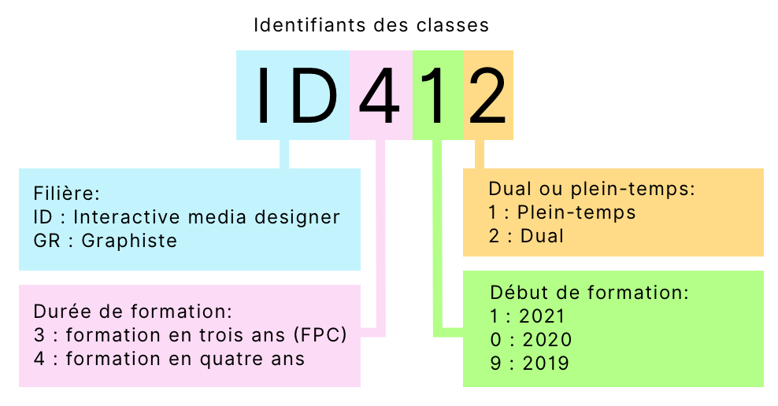

## Formation IMD à l'Eracom

La formation IMD à l'eracom peut s'effectuer en deux modes différents:

### 1) Formation duale

Durée: 4 ans.  
Classes: ID462, 452, 442, 432.  
Dans le système dual, les élèves signent un contrat d’apprentissage avec une entreprise formatrice. Ils suivent les cours en école 1 à 2 jours par semaine (2 jours les 2 premières années, ensuite 1 jour). Ils ont également des [cours interentreprise (CIE)](cours-cie.html), 5 fois durant la formation.    

### 2) Formation en école de métiers (plein-temps)

Durée: 4 ans.  
Classes: ID460 & 461, 450 & 451, 441, 431.  
Ces élèves suivent une demi-journée de cours de culture générale (ECG).

Une partie des élèves effectue la [maturité professionnelle intégrée](https://eracom.ch/formation/maturite-professionnelle-integree-arts-visuels-et-arts-appliques/), un jour et demi de cours y est dédié (généralement lundi et mardi).

## Les noms des classes

L'eracom pratique un système de noms de classes qui permet d'identifier :

- **La filière** (ID, GR, PA...)
- **Premier chiffre: la durée de formation**. 4 indique une classe suivant le cursus sur 4 ans (3 indique une classe à formation condensée sur 3 ans).
- **2e chiffre: année du début de formation**. 0 pour 2020, 1 pour 2021, etc.
- **3e chiffre: type de formation**. 0 ou 1 pour "école plein temps" / 2 pour "formation duale".

Explication illustrée:

## La formation IMD en Suisse

La formation IMD est donnée dans dix écoles en Suisse:

En Suisse romande et au Tessin:

1. Lausanne ([eracom](https://eracom.ch/)), formation duale, plein-temps et FPC.
2. Fribourg ([Eikon](https://eikon.ch/)), formation plein-temps.
3. Genève ([CFP Arts](https://cfparts.ch/metiers/interactive-media-design/)), formation plein-temps.
4. La Chaux-de-Fonds ([EAA](https://www.eaa-la-chaux-de-fonds.ch/formation/interactive-media-designer)), formation plein-temps.
5. Bienne ([Schule für Gestaltung Bern und Biel](https://sfgb-b.ch/), formation plein-temps, depuis 2022).
6. Lugano ([CSIA](https://www.csia.ch/)), formation plein-temps.

En Suisse alémanique: 

1. Bâle ([Schule für Gestaltung Basel](https://www.sfgbasel.ch/)), formation duale.
2. Berne ([Schule für Gestaltung Bern und Biel](https://sfgb-b.ch/bildungsangebote/berufsfachschule/interactive-media-designer)), formation duale.
3. Saint-Gall ([GBSSG](https://www.gbssg.ch/gestaltung/berufliche-grundbildung/interactive-media-designerin-efz.html)), formation duale et [Ecole supérieure](https://www.gbssg.ch/weiterbildung/design/interactive-media-design-hf.html).
4. Zurich: [SfGZ](https://sfgz.ch/schule/promotion-imd/interactiv-media-designer) (depuis 2026).
