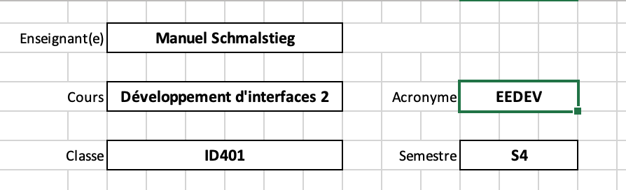
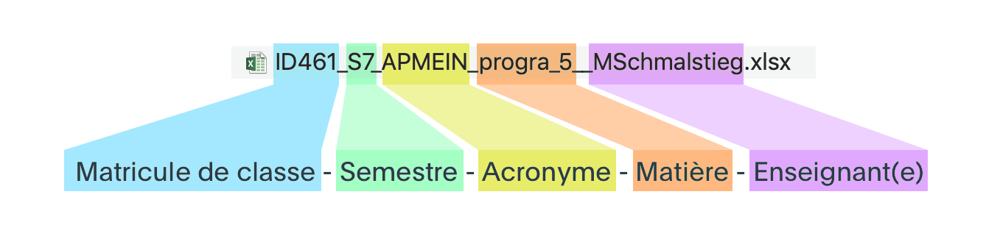

## Saisie et transmission des notes

Les notes, en fin de semestre, doivent être transmises par deux moyens:

1. Transmises au Maître Principal dans le formulaire Excel, [disponible dans Teams](https://eduvaud.sharepoint.com/:f:/r/sites/ERACOM_ID_Teams/Documents%20partages/General/Fiches%20de%20notes?csf=1&web=1&e=PfBRy1)
2. Saisies par l'enseignant·e dans la [plateforme e*SA](https://www.portail.vd.ch/iam/accueil/).

### Points importants

- Le nombre de notes minimum, pour chaque cours, est de 3. (voir [Attribution de notes](attribution-notes.html))
- Il ne faut pas saisir la moyenne du semestre, mais **chaque évaluation** à la date que vous avez fixé pour l'évaluation.
- Les dates doivent être identiques dans le document Excel et la saisie e\*SA. Même si une évaluation a été répartie sur plusieurs semaines, définissez **une date** pour la saisie.

### Points importants pour les fiches Excel

Les fichiers Excel sont [disponibles dans Teams](https://eduvaud.sharepoint.com/:f:/r/sites/ERACOM_ID_Teams/Documents%20partages/General/Fiches%20de%20notes?csf=1&web=1&e=PfBRy1). Vous trouvez un modèle pour chaque classe.

Veillez à bien renseigner les champs suivants:

- Votre nom
- Le nom du cours
- **L'acronyme du cours**. Vous le trouvez [dans la fiche de votre cours](https://code.eracom-pedagogique.ch/formation-imd/?vue=profs).

Veillez à **renommer le fichier selon le modèle suivant**. Vous pouvez abréger le nom du cours par souci de lisibilité, mais indiquez **l'acronyme** et votre nom.

### Points importants pour la saisie dans e\*SA

Lien e\*SA: [https://www.portail.vd.ch/iam/accueil/](https://www.portail.vd.ch/iam/accueil/)

**EP** : école professionelle = les classes duales.  
**EM** : école des métiers = les classes plein-temps.

- Saisissez séparément chacune des notes semestrielles (et non pas la moyenne du semestre).
- Saisissez les notes sur la date que vous indiquez dans le fichier Excel.
- Veillez à ***valider*** les notes après l'enregistrement dans e\*SA. Si elles ne sont pas validées, cela empêche l'impression du bulletin.

Délai de saisie et de transmission des notes :  
Semestre d'automne: **vendredi 20 janvier 2023**  
Semestre de printemps: **vendredi 16 juin 2023**

Cette vidéo montre comment fonctionne la saisie dans ESA:

<iframe src="https://player.vimeo.com/video/705756507?h=8ef61f5b55&amp;badge=0&amp;autopause=0&amp;player_id=0&amp;app_id=58479" frameborder="0" allow="autoplay; fullscreen; picture-in-picture" allowfullscreen style="position:absolute;top:0;left:0;width:100%;height:100%;" title="Saisie des notes dans ESA"></iframe>

