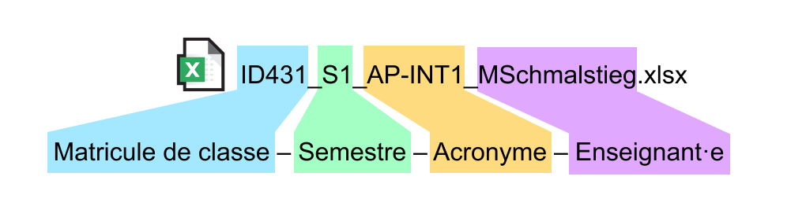

## Saisie et transmission des notes

Les notes, en fin de semestre, doivent être transmises par deux moyens:

1. Transmises au Maître Principal dans le fichier Excel, [disponible dans Teams](https://eduvaud.sharepoint.com/:f:/r/sites/ERACOM_ID_Teams/Documents%20partages/General/Fiches%20de%20notes%20%C3%A0%20t%C3%A9l%C3%A9charger?csf=1&web=1&e=anuAqG)
2. Saisies par l'enseignant·e dans la [plateforme LAGAPEP](https://www.portail.vd.ch/iam/accueil/).

### Points importants

- Le nombre de notes minimum, pour chaque cours, est de 3. (voir [Attribution de notes](attribution-notes.html))
- Il ne faut pas saisir la moyenne du semestre, mais **chaque évaluation** à la date que vous avez fixé pour l'évaluation.
- Les dates doivent être identiques dans le document Excel et la saisie LAGAPEP. Même si une évaluation a été répartie sur plusieurs semaines, définissez **une date unique** pour la saisie.

### Points importants pour les fiches Excel

Les fichiers Excel sont [disponibles dans Teams](https://eduvaud.sharepoint.com/:f:/r/sites/ERACOM_ID_Teams/Documents%20partages/General/Fiches%20de%20notes%20%C3%A0%20t%C3%A9l%C3%A9charger?csf=1&web=1&e=anuAqG). Vous trouvez un modèle pour chaque classe.

Veillez à bien renseigner les champs suivants:

- Votre nom
- Le nom du cours
- **L'acronyme du cours**. Vous le trouvez [dans la fiche de votre cours](https://code.eracom-pedagogique.ch/formation-imd/?vue=profs).

Veillez à **renommer le fichier selon le modèle suivant**. Indiquez **l'acronyme** (sans le préfixe ID) et votre nom. Pas besoin de mettre le nom du cours.

### Saisie dans LAGAPEP

Vous pouvez consulter ce tutoriel pour découvrir toutes les fonctionnalités, notamment la saisie des notes:  
[bit.ly/formation-lagapep](https://bit.ly/formation-lagapep)
