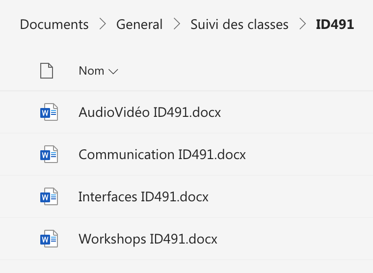
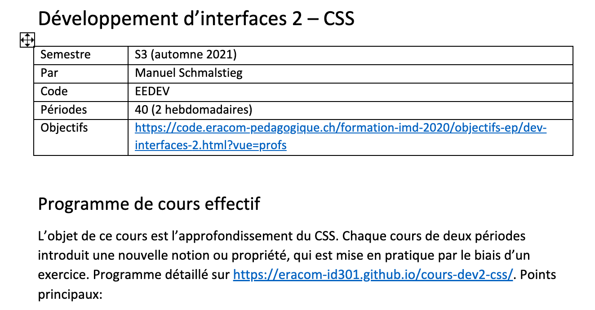

Précisions sur la procédure de transmission de fin de semestre.

Pour une bonne coordination de la formation, il est important de faire un suivi des classes de semestre en semestre, pour "savoir ce que telle classe a déjà fait".

Il est donc important que chaque enseignant·e complète systématiquement les **fiches de suivi** (aussi appelées "fiches de transmission"). 

## Les fiches 

Ces fiches se trouvent dans Teams: **Fichiers > [Suivi des classes](https://eduvaud.sharepoint.com/:f:/s/ERACOM_ID_Teams/Esumqmo48XpDoxxBQSKVAm0BW9uNAgWJnDmBy3QcMBehKA?e=HlxkXc)**. 

Les fiches sont organisées **par classe** et **par domaine**. Cela permet une vision transversale du parcours des classes. Les domaines sont:

- **Anglais**
- **Audiovisuel** (comprend: Vidéo, Son, Motion design, 3D)
- **Communication** (comprend: Création d'images, Marketing, Photo)
- **Interfaces** (comprend: Design, Développement, Recherche UX)

Dans chaque fiche, l'ordre est **anti-chronologique**: le semestre le plus récent doit se trouver au début du document.

## Procédure à la fin du semestre

L'enseignant·e, pour chaque cours donné, ajoute une section et complète les champs prévus. Les informations importantes:

- Programme de cours effectif (ce qui a été fait)
- Évaluations effectuées (les travaux qui ont été notés)

Veillez à faire un résumé concis. Si vous souhaitez mettre en lien des supports de cours ou réalisations d'élèves, vous pouvez les mettre en annexe (dans **Fichiers > [Productions](https://eduvaud.sharepoint.com/:f:/s/ERACOM_ID_Teams/Ekp6q_FmR2pBkxl2f1BLWbQBIb2b5ocMUN3EmvgoV4ORQQ?e=Zc7pj8)**).

