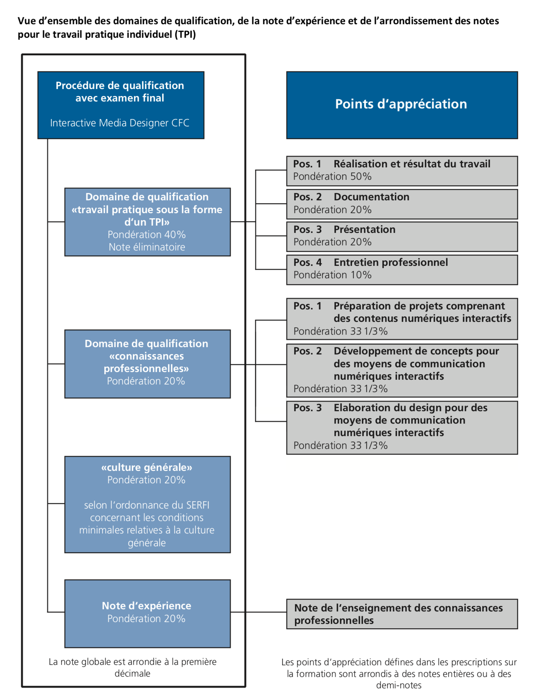

La procédure de qualification comporte deux éléments:

- le travail pratique individuel (TPI)
- l’examen de connaissances professionnelles (CP ou ConPro)

### Travail pratique individuel (TPI)

Le **travail pratique individuel** (TPI) se fait sur une durée de 80 à 120 heures (ordonnance, §16 a), à partir du mois de mai de la dernière année. En école de métiers, le sujet est imposé, mais l’élève a le choix entre différents types de médias. En dual, l’élève définit le sujet avec son formateur. 

Pour les élèves en formation plein-temps, le sujet est identique. Il est élaboré par la **Comission romande d'examen**, comprenant des enseignant·es des quatre écoles de Suisse romande (Fribourg, Genève, La Chaux-de-Fonds, Lausanne). 

Pendant la durée de ce travail (trois semaines à temps plein), l’élève est accompagné·e par un·e **supérieur·e de candidat·e** (un·e de ses enseignant·es ID de l’eracom) qui va aussi évaluer la réalisation du travail. Deux expert·es externes évaluent la documentation, la présentation orale, et l’entretien professionnel.

Les critères d’évaluation sont définis pour l’ensemble de la Suisse (par l’office paritaire de formation, PBS).

#### Exemples de données d'examen

Des exemples de données TPI des années précédentes (ainsi que des travaux de candidats) se trouvent dans Teams, sous [Examens > Archives TPI](https://eduvaud.sharepoint.com/:f:/r/sites/ERACOM_ID_Teams/Documents%20partages/General/Ressources%20enseignement/Examens%20-%20archives/Archives%20TPI%202018-22?csf=1&web=1&e=vNlBCV). Les thèmes utilisés dans les écoles romandes: campagne pour le groupement des eaux de Romandie (2018), les jardins partagés (2019), Rec’Up ! (2021), antiguide touristique (2022), festivals de musique (2023).

Dpsuisse propose [une liste d'exemples de mandat TPI](https://dpsuisse.ch/ideenpool-aufgabenstellung) utilisés dans des entreprises formatrices.

### Examen de connaissances professionnelles

L’examen de **connaissances professionnelles** porte sur toutes les branches CP du plan de formation. La durée est de **4 heures** (ordonnance, §16 b). C’est un examen ecrit, effectué en trois parties, sur une journée. Il a lieu en fin de dernier semestre (mi-mai ou début juin). Il est identique pour les élèves IMD dans toute la Suisse. 

### Calcul des notes et critères d'évaluation

Le calcul des notes est détaillé dans les «Dispositions d’exécution» (p. 4), sur le site [imd-tpi.ch](https://www.imd-tpi.ch/), dans la section [Documentation](https://www.imd-tpi.ch/documentations/). Ce site informe également sur les dates, et fournit les grilles d'évaluation.

