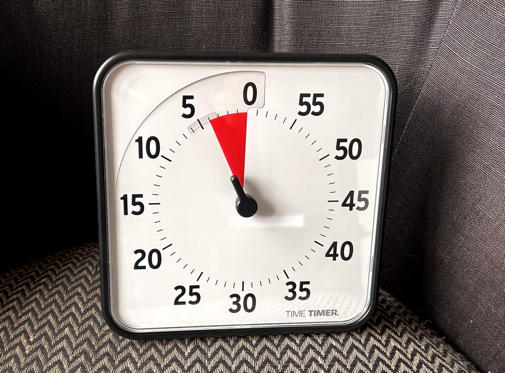
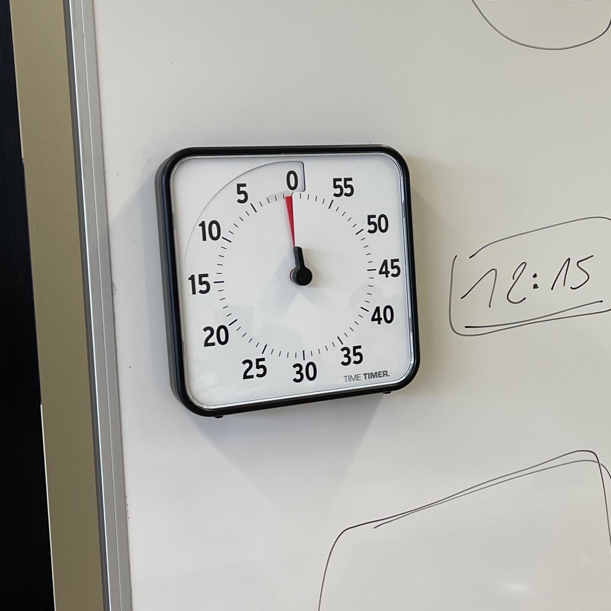

L'Eracom a fait l’acquisition de plusieurs Time Timer. Il s’agit de « minuteurs visuels » permettant d’afficher un décompte des minutes.

Ces Time Timer sont à votre disposition en mode « self-service » en salle 403. Vous les trouvez dans l’armoire à la droite en entrant dans la salle.

Lorsque vous empruntez l’un des Timer, veuillez remplir la fiche se trouvant sur l’armoire.

## Utilisations possibles

- Brainstorming, recherche d'idées: plus efficace avec une limite de temps.
- Séquence d’activités: aide à respecter le déroulement et le contenu planifié.
- Présentations des élèves: clarifie le temps restant.
- Présentation par l’enseignant-e.
- Aide à respecter l’horaire lors de séances, réunions, entretiens...

Je vous encourage à tester cet appareil pour en découvrir le potentiel.

## Avantages par rapport à une application

- C’est un objet matériel, qui rend la dimension du temps plus concrète.  
- Le réglage se fait par un geste, c'est plus rapide que de passer par une app.
- Le Timer est maniable, on peut le poser sur le bureau du prof (pour auto-monitorer votre temps de présentation)
- On peut l’accrocher au whiteboard, pour qu’il soit visible par la classe.

